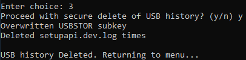

# Anti-Forensics Toolkit (User Manual)

Anti-Forensics Toolkit aims to securely delete selected files, securely delete known forensic artifacts, and manipulate timestamps of selected files.

## Table Of Contents

- [Anti-Forensics Toolkit (User Manual)](#anti-forensics-toolkit-user-manual)
  * [Table Of Contents](#table-of-contents)
  * [Getting Started](#getting-started)
    + [Requirements](#requirements)
    + [Libraries](#libraries)
    + [Executing program](#executing-program)
  * [Authors](#authors)


## Getting Started

### Requirements

- Windows 10
- Python 3 (if running the .py file instead of .exe)


### Libraries

- win32-setfiletime
```
pip install -r requirements.txt
```

### Executing the program

- Run the script or the pre-compiled binary to bring up a menu of choices.
```
python3 anti-forensics-toolkit.py
```

```
.\anti-forensics-toolkit.exe
```


#### Option One (Secure Delete)

1. Enter "1" as the choice.
2. Specify one or more files to securely delete, with each file separated by a "|".
3. Proceed with the deletion when prompted.


#### Option Two (Delete file opening artifacts)

1. Enter "2" as the choice.
2. Proceed with the deletion when prompted.


#### Option Three (Delete USB Registry Key Identification)

1. Enter "3" as the choice.
2. Proceed with the deletion when prompted.




#### Option Four (Delete Browser Artifacts)

1. Enter "4" as the choice.
2. Proceed with the deletion when prompted.


#### Option Five (Change timestamps)

1. Enter "5" as the choice.
2. Specify one or more files to change timestamps of, with each file separated by a "|".
3. Proceed with the change when prompted. The current timestamps of the file will be displayed.


4. Proceed with changing one or more timestamps when prompted.


#### Option Six (Exit)

1. Enter "6" as the choice. Program simply exits without doing anything.

## Authors

- Ng Wei Liang

- Koh Cheng Kiat

- Jovian Ng

- Liew Jwo Young

 
